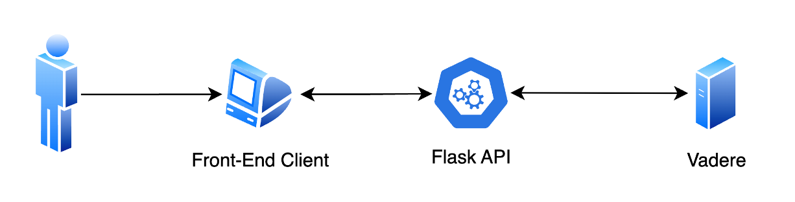

# Final Project

This final project focuses on developing a Web-based Crowd Trajectory Visualization Framework. The aim is to create an interactive application that facilitates the visualization of crowd trajectories on a 2D grid-based map. The project is divided into five key tasks, each addressing a specific aspect of the framework's functionality.

In conclusion, the Web-based Crowd Trajectory Visualization Framework project addresses diverse aspects of crowd simulation and visualization, from setting up the initial software environment to implementing advanced algorithms and providing API support. The framework aims to be a comprehensive tool for researchers and practitioners in the field.


## Installation

The project consist of two parts:

### Back-end

API support to connect Vadera application through the console on the server side and leverage all features of the application.

To run back-end you will need to have the following dependencies installed

- Python 3.7 or higher,
  - You can install necessary python libraries by running the following command:
  ```bash
  pip install -r /path/to/requirements.txt
  ```

- [Vadere 2.6](https://www.vadere.org/download/) (OS does not matter, **must be placed under the builds folder as named "vadere.v2.6"**)
  - Vadere requires Java 11 or above, recommended Java 17.


After the dependency installation you can run the back-end from `app.py` script. Do not forget to change the port, ip address and other settings according to your needs.

### Front-end

Web-based trajectory visualization application with HTML/CSS and JavaScript. The application will operate on a 2D grid-based map, laying the foundation for the entire framework.

No need to setup any additional dependencies but you need to change API end-point URL according to back-end application. Only browser and you can access the client from `index.html`.



## API Details

### Run Scenario

This Flask API is designed to execute scenarios using Vadere simulation. The `run-scenario` allows you to send a POST request with scenario input data, and it returns the results of the executed scenario.

> [!WARNING]  
> The service covers scenarios with a simulation time of up to 50 seconds only due to Vadere's fixed finishTime setting.

**URL** : `/run-scenario`

**Method** : `POST`

**Auth required** : NO

<details>
 <summary><b>Data constraints</b></summary>

---

**model_name**

- **Type:** String
- **Constraints:** Required
- **Value:** osm, fsm, gnm

**source**

- **Type:** Object
- **Constraints:** Required

  **shape**

  - **Type:** Object
  - **Constraints:** Required

    **x**

    - **Type:** Number
    - **Constraints:** Required

    **y**

    - **Type:** Number
    - **Constraints:** Required

**event_element_count**

- **Type:** Number
- **Constraints:** Required

**target**

- **Type:** Object
- **Constraints:** Required

  **shape**

  - **Type:** Object
  - **Constraints:** Required

    **x**

    - **Type:** Number
    - **Constraints:** Required

    **y**

    - **Type:** Number
    - **Constraints:** Required

**obstacles**

- **Type:** Array of Objects
- **Constraints:** Optional (if present, must be an array)

  **Each Object in the Array**

  - **id**

    - **Type:** Number
    - **Constraints:** Required
    - **Value:** Can not be 1 or 2

  - **shape**

    - **Type:** Object
    - **Constraints:** Required

      **x**

      - **Type:** Number
      - **Constraints:** Required

      **y**

      - **Type:** Number
      - **Constraints:** Required

      **width**

      - **Type:** Number
      - **Constraints:** Required

      **height**

      - **Type:** Number
      - **Constraints:** Required

---
</details>

<details>

 <summary><b>Example Request</b></summary>
</br>

```json
{
  "model_name": "osm",
  "source": {
    "shape": {
      "x": 5,
      "y": 5
    },
    "event_element_count": 1
  },
  "target": {
    "shape": {
      "x": 30,
      "y": 30
    }
  },
  "obstacles": [
    {
      "id": 29,
      "shape": {
        "x": 25,
        "y": 15,
        "width": 1,
        "height": 5
      }
    },
    {
      "id": 28,
      "shape": {
        "x": 20,
        "y": 15,
        "width": 2,
        "height": 5
      }
    }
  ]
}
```
</details>


<details>

 <summary><b>Success Response</b></summary>
</br>

**Code** : `200 OK`

**Content example**

```json
{
    "message": "Scenario executed successfully",
    "data": [
        {
            "pedestrianId": 1,
            "simTime": 0.4,
            "endTime-PID1": 1.0462944974202133,
            "startX-PID1": 18.201,
            "startY-PID1": 17.201,
            "endX-PID1": 18.600763151745376,
            "endY-PID1": 16.5824780131855,
            "targetId-PID2": 2
        },
        {
            "pedestrianId": 1,
            "simTime": 1.0462944974202133,
            "endTime-PID1": 1.692588994840427,
            "startX-PID1": 18.600763151745376,
            "startY-PID1": 16.5824780131855,
            "endX-PID1": 18.60076315174538,
            "endY-PID1": 15.846013468440573,
            "targetId-PID2": 2
        },
        {
            "pedestrianId": 1,
            "simTime": 1.692588994840427,
            "endTime-PID1": 2.33888349226064,
            "startX-PID1": 18.60076315174538,
            "startY-PID1": 15.846013468440573,
            "endX-PID1": 18.600763151745376,
            "endY-PID1": 15.109548923695645,
            "targetId-PID2": 2
        },
        {
            "pedestrianId": 1,
            "simTime": 2.33888349226064,
            "endTime-PID1": 2.985177989680853,
            "startX-PID1": 18.600763151745376,
            "startY-PID1": 15.109548923695645,
            "endX-PID1": 18.031377779379184,
            "endY-PID1": 14.642451157267924,
            "targetId-PID2": 2
        },
        {
            "pedestrianId": 1,
            "simTime": 2.985177989680853,
            "endTime-PID1": 3.631472487101066,
            "startX-PID1": 18.031377779379184,
            "startY-PID1": 14.642451157267924,
            "endX-PID1": 17.362749472295896,
            "endY-PID1": 14.333717918640655,
            "targetId-PID2": 2
        },
        {
            "pedestrianId": 1,
            "simTime": 3.631472487101066,
            "endTime-PID1": 4.277766984521279,
            "startX-PID1": 17.362749472295896,
            "startY-PID1": 14.333717918640655,
            "endX-PID1": 16.742657703949874,
            "endY-PID1": 14.335881026492304,
            "targetId-PID2": 2
        },
        {
            "pedestrianId": 1,
            "simTime": 4.277766984521279,
            "endTime-PID1": 4.924061481941493,
            "startX-PID1": 16.742657703949874,
            "startY-PID1": 14.335881026492304,
            "endX-PID1": 16.144280261344623,
            "endY-PID1": 14.38191006053886,
            "targetId-PID2": 2
        },
        {
            "pedestrianId": 1,
            "simTime": 4.924061481941493,
            "endTime-PID1": 5.570355979361707,
            "startX-PID1": 16.144280261344623,
            "startY-PID1": 14.38191006053886,
            "endX-PID1": 15.510854914078529,
            "endY-PID1": 14.630350474599071,
            "targetId-PID2": 2
        },
        {
            "pedestrianId": 1,
            "simTime": 5.570355979361707,
            "endTime-PID1": 6.21665047678192,
            "startX-PID1": 15.510854914078529,
            "startY-PID1": 14.630350474599071,
            "endX-PID1": 15.385292681877443,
            "endY-PID1": 15.356032327418225,
            "targetId-PID2": 2
        },
        {
            "pedestrianId": 1,
            "simTime": 6.21665047678192,
            "endTime-PID1": 6.862944974202134,
            "startX-PID1": 15.385292681877443,
            "startY-PID1": 15.356032327418225,
            "endX-PID1": 15.385292681877443,
            "endY-PID1": 16.09249687216315,
            "targetId-PID2": 2
        },
        {
            "pedestrianId": 1,
            "simTime": 6.862944974202134,
            "endTime-PID1": 7.509239471622347,
            "startX-PID1": 15.385292681877443,
            "startY-PID1": 16.09249687216315,
            "endX-PID1": 15.75171605285868,
            "endY-PID1": 16.694302186823606,
            "targetId-PID2": 2
        },
        {
            "pedestrianId": 1,
            "simTime": 7.509239471622347,
            "endTime-PID1": 8.15553396904256,
            "startX-PID1": 15.75171605285868,
            "startY-PID1": 16.694302186823606,
            "endX-PID1": 16.119948325231142,
            "endY-PID1": 17.06253445919607,
            "targetId-PID2": 2
        }
    ]
}
```
</details>

---

### Get Models

This Flask API is designed to list avaliable models of Vadere. The `get-models` list necessary model names to execute a simulation.

**URL** : `/get-models`

**Method** : `GET`

**Auth required** : NO

<details>

 <summary><b>Success Response</b></summary>
</br>

**Code** : `200 OK`

**Content example**

```json
{
    "message": "Available models listed successfully",
    "data": [
        "osm",
        "sfm",
        "gnm",
        "sct"
    ]
}
```
</details>